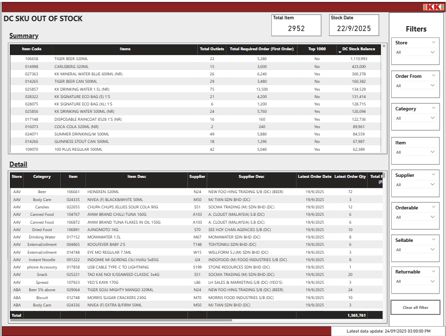
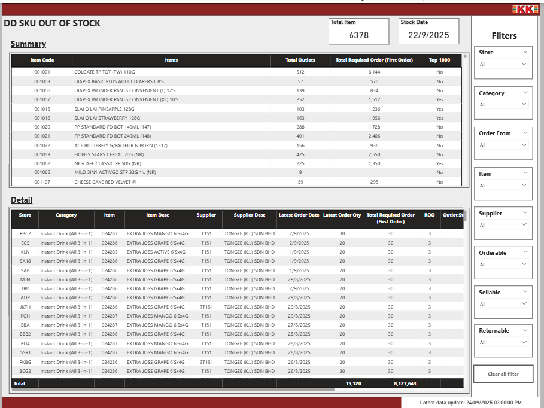
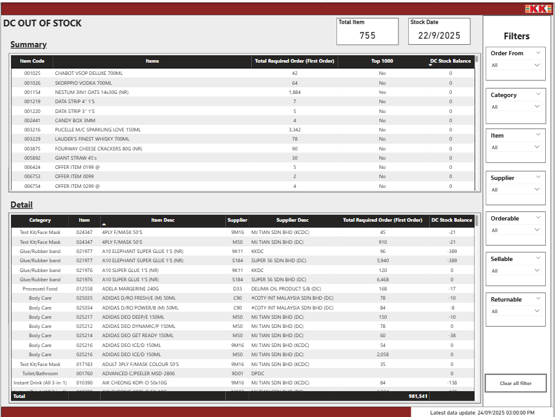

## 💰 Store OOS Report

### 📊 Dashboard Preview

### 🚀 Live Demo
🔗 [View Power BI Dashboard](https://app.powerbi.com/view?r=example)

### 🧠 Overview
This report tracks **store-level Out-of-Stock (OOS)** performance across multiple sales channels.  
It provides real-time insights into inventory availability, restocking efficiency, and product supply consistency across outlets.

The dashboard helps operations and supply teams identify which stores or SKUs are experiencing frequent OOS issues and plan replenishments more efficiently.

---

### ⚙️ Technical Summary
- **Data Sources:**  
  - 🟥 **Amazon Redshift:** Processed data warehouse tables  
  - 🟦 **SQL Server / DWH:** Source operational data  

- **ETL Pipeline:**  
  - Data extracted from SQL Server (transactional source)  
  - Cleaned and transformed using **AWS Glue PySpark Python scripts**  
  - Loaded into **Amazon Redshift** for analytical querying
  - Source data was processed and transformed through **AWS Glue ETL jobs** developed using **PySpark (Python)** before loading into **Amazon Redshift**

- **Model Design:**  
  - Star-schema model with `fact_sales`, `dim_store`, and `dim_product`  
  - Calculated measures and relationships handled in **Power BI**  

- **Transformations:**  
  - Python scripts applied data cleaning, standardization, and time-based aggregations  
  - Power BI DAX used for KPI logic (OOS rate, availability %, etc.)

---

### 📊 Key Metrics
- Store-level OOS Rate (%)  
- Daily Stock Availability Trend  
- Top 10 Frequently OOS Products  
- Supplier Fill Rate  
- Category & Region-based OOS Comparison  

---

### 🧩 Report Features
- Dynamic date and store-level filtering  
- Color-coded visual indicators for OOS severity  
- Cross-filtering between SKU, category, and store visuals  
- Automatic daily refresh via Redshift connection  
- Timestamp display for transparency  

> 🕒 *Data pipeline auto-refreshes daily through AWS Glue.*  
> ⚡ *Combines multi-source data (SQL Server → Glue → Redshift → Power BI).*

> 💡 *Used SQL joins in Redshift to merge merchant, product, and pricing data before loading into Power BI.*
